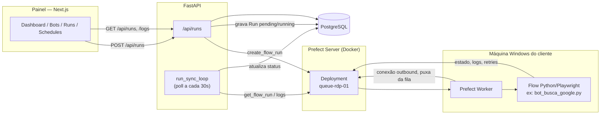

# Regista

RPAaaS: orquestra robôs Python/Playwright que rodam dentro da máquina do cliente, dando a quem mantém esses robôs visibilidade central de disparo, status, logs e falhas através de um painel web.

## O problema

Um robô de RPA normalmente roda na máquina do próprio cliente — um RDP Windows, muitas vezes escolhido porque é ali que existe a sessão logada, a VPN da empresa ou o sistema legado que o robô precisa acessar. Isso tira a execução de qualquer infraestrutura de quem mantém o robô. Na prática, o modelo mais comum é "instala e esquece": o robô roda, ninguém olha, e o primeiro sinal de que algo quebrou é o processo de negócio parar — um relatório que não chegou, um cadastro que não foi feito — muitas vezes dias depois do robô ter falhado silenciosamente.

O Regista existe para fechar essa lacuna sem mudar onde o robô roda. A execução continua descentralizada, na rede do cliente, mas o disparo, o histórico, o status de cada execução e (parcialmente, ver seção Status) o alerta de falha passam a existir num lugar central: um backend e um painel que quem opera os robôs acessa, independente de estar ou não dentro da rede de nenhum cliente.

## Como funciona

O caminho real de uma execução:

1. Alguém aciona um bot pelo painel (`POST /api/runs`, disparo manual) ou uma futura execução agendada faria o mesmo.
2. O FastAPI cria uma `Run` no Postgres com status `pending` e chama `create_flow_run` na API REST do Prefect Server, usando o `prefect_deployment_id` gravado no bot.
3. O Prefect Worker já está rodando como serviço Windows na máquina do cliente, escutando a fila daquela máquina especificamente (`queue-rdp-01`, `queue-rdp-02`, ...). Ele puxa o flow run assim que ele aparece na fila.
4. O worker executa o flow localmente: abre o Chromium na sessão gráfica do RDP e roda a automação Playwright ponta a ponta, dentro de uma única função (ver decisão sobre `@flow` sem `@task` no bot template).
5. O Prefect Server acumula o estado (`RUNNING`, `COMPLETED`, `FAILED`, `CRASHED`...) e os logs emitidos pelo flow, incluindo screenshots de erro que o próprio bot tira antes de falhar.
6. Em paralelo, um loop assíncrono dentro do próprio processo FastAPI (`run_sync_loop`) pergunta ao Prefect, a cada 30 segundos, o estado de cada `Run` ainda pendente ou rodando, e grava a mudança no Postgres.
7. O painel nunca fala com o Prefect — ele só lê `/api/runs` e `/api/runs/{id}/logs` do FastAPI, que por sua vez busca os logs no Prefect sob demanda.

Cada fila (`queue-rdp-01`, `queue-rdp-02`, ...) existe para isolar máquinas fisicamente: evita dois robôs disputando a mesma sessão gráfica de um mesmo RDP.

## Decisões de arquitetura

### Prefect OSS self-hosted, não um agendador próprio ou Celery/RQ

**Decisão:** usar o Prefect OSS, autogerenciado via Docker, como motor de orquestração.
**Alternativa descartada:** montar fila própria (Celery ou RQ) com um scheduler caseiro por cima.
**Por quê:** o Prefect já entrega de graça o que seria a parte mais cara de construir do zero — UI de observabilidade de execuções, retries e delay declarativos (`@flow(retries=3, retry_delay_seconds=60)`) e, principalmente, work queues nativas que resolvem exatamente o problema de rotear cada robô para a máquina certa sem conflito de sessão. Reconstruir isso em cima de Celery seria reconstruir boa parte do próprio Prefect.

### Worker roda na máquina do cliente, não navegador remoto centralizado

**Decisão:** o Prefect Worker e o Playwright rodam dentro da máquina Windows do próprio cliente.
**Alternativa descartada:** backend controlando um navegador central (headless ou remoto) a partir de um servidor único.
**Por quê:** boa parte dos robôs depende de algo que só existe dentro da rede do cliente — sessão já logada, VPN corporativa, certificado instalado, sistema legado sem acesso externo — e isso não é replicável num servidor central. Some a isso o custo e a instabilidade de manter dezenas de sessões de Chromium com janela visível (o template de bot roda com `HEADLESS=False` por padrão, porque em RDP precisa de sessão gráfica ativa) rodando 24/7 num servidor compartilhado.

### Worker conecta outbound; o backend nunca entra na rede do cliente

**Decisão:** o Prefect Worker se conecta de dentro para fora até o Prefect Server, na porta 4200.
**Alternativa descartada:** abrir porta de entrada no firewall do cliente, ou manter VPN/túnel reverso do backend até cada máquina.
**Por quê:** conexão outbound-only tira do produto qualquer negociação de firewall com o cliente — a máquina Windows só precisa alcançar o Prefect Server, nunca o contrário. Isso também é o que resolve, na prática, a questão de rede do cliente: não há necessidade de VPN dedicada nem regra de firewall além de liberar a saída.

### Status sincronizado por polling, não por push/webhook

**Decisão:** o próprio FastAPI, num loop em background dentro do seu processo (`run_sync_loop`, a cada 30 segundos), pergunta ao Prefect o estado de cada run ativa.
**Alternativa descartada:** o Prefect notificar o backend via webhook quando o estado de um flow run muda.
**Por quê:** no estágio atual do produto não havia necessidade de status em tempo real — um atraso de até 30 segundos é aceitável — e polling evita ter que expor um endpoint público que o Prefect chamaria de volta. Push fica como evolução natural se o painel precisar ficar mais reativo.

### Cada robô é um `@flow` só, sem `@task`

**Decisão:** o template de bot (`bot_template.py`) implementa todas as etapas do robô — abrir browser, logar, automatizar, tirar screenshot — como funções comuns chamadas dentro de um único `@flow`, nunca decoradas com `@task`.
**Alternativa descartada:** quebrar cada etapa em `@task` separadas, como o Prefect recomenda por padrão, para ganhar granularidade de retry e visibilidade por etapa.
**Por quê:** esta é a única decisão documentada diretamente no código-fonte, não inferida — o comentário no template explica que a API síncrona do Playwright fica presa à thread onde o browser foi lançado (usa fibers/greenlet), enquanto o Prefect executa cada `@task` numa thread separada do pool. Decorar uma etapa com `@task` estoura `greenlet.error: Cannot switch to a different thread`. Rodar tudo dentro do `@flow`, numa única thread, é o que evita esse conflito.

## Stack

| Camada | Tecnologia | Função |
|---|---|---|
| Frontend | Next.js 14 + TailwindCSS | Painel web (dashboard, bots, runs, agendamentos) |
| Auth | NextAuth.js (Credentials) | Login e sessão JWT no frontend, com `client_id`/`role` decodificados do token |
| Backend | FastAPI (async) | API REST consumida pelo painel; nunca expõe o Prefect diretamente |
| ORM / migrações | SQLAlchemy async + Alembic | Modelo de dados e versionamento de schema |
| Banco | PostgreSQL | Dados da aplicação e, num schema separado, dados internos do Prefect |
| Cache/fila | Redis | Provisionado no docker-compose; sem uso no código ainda |
| Orquestração | Prefect OSS (self-hosted) | Deployments, filas por máquina, retries, histórico e logs de execução |
| Execução do robô | Python 3.11 + Playwright + Prefect Worker | Roda dentro da máquina do cliente, dispara o navegador local |
| Infra local | Docker Compose | Sobe Postgres, Redis e Prefect Server |
| Serviço Windows | NSSM | Mantém o Prefect Worker rodando como serviço na máquina do cliente |

## Estrutura do projeto

- `backend/` — API FastAPI: modelos, rotas, schemas Pydantic, integração com o Prefect via REST e migrações Alembic.
- `frontend/` — Painel Next.js 14 (App Router): login, dashboard, listagem de bots, execuções e agendamentos.
- `infra/` — `docker-compose.yml` e configuração de inicialização do PostgreSQL para desenvolvimento local.
- `workers/` — Scripts que rodam na máquina do cliente: template de bot, bot de demonstração, script de registro de deployment no Prefect e setup do worker Windows.

## Status

**Funciona:** autenticação JWT multi-tenant; CRUD de clientes, bots, máquinas e agendamentos com isolamento por `client_id`; disparo de execução via API REST do Prefect; sincronização de status por polling; um bot de demonstração real executando via Playwright (`bot_busca_google.py`); painel consumindo dados reais da API, sem dados mockados.

**Incompleto:**
- Agendamentos (`schedules`) só têm CRUD — não existe ainda um motor que leia o `cron_expression` salvo e efetivamente dispare a run no horário certo. Hoje toda execução é manual, via painel ou API.
- Existe um endpoint de heartbeat de máquina (`POST /machines/{id}/heartbeat`), mas nenhum script em `workers/` o chama ainda — o campo `status` de `machines` não é atualizado automaticamente, então "online"/"offline" no banco não reflete a realidade sozinho.
- A tabela `alerts` existe no modelo de dados, com canais `email` e `whatsapp` previstos, mas não tem rota de API nem integração com Evolution API/Z-API ou SMTP implementada — só variáveis de ambiente reservadas para isso no `.env.example`. Uma falha hoje fica visível apenas para quem olhar o painel.
- Redis está no `docker-compose` mas nenhum código do backend o usa até agora — provisionado para necessidade futura (fila, cache, sessão), sem consumidor ainda.
- Sem HTTPS em desenvolvimento local — decisão deliberada, adiada para a migração a um VPS.

Em desenvolvimento ativo. Para subir localmente: `docker compose -f infra/docker-compose.yml up -d` (Postgres, Redis, Prefect Server), depois `uvicorn app.main:app --reload --port 8000` em `backend/` e `npm run dev` em `frontend/`.
